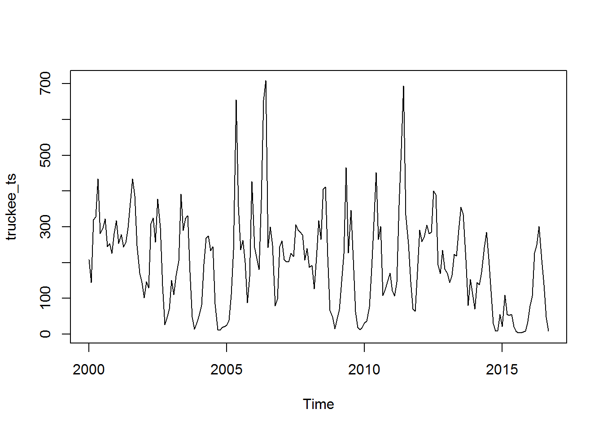
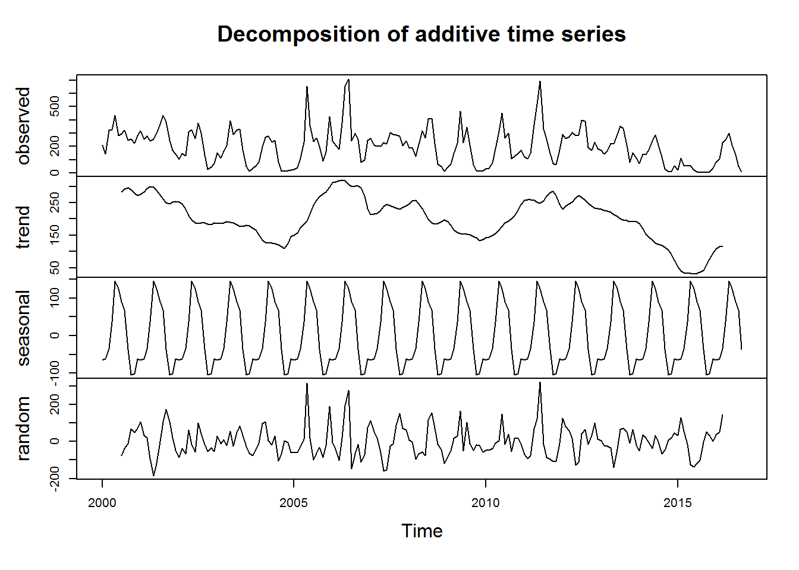
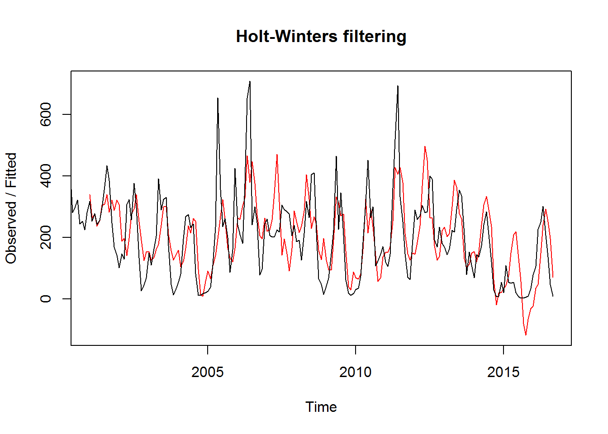
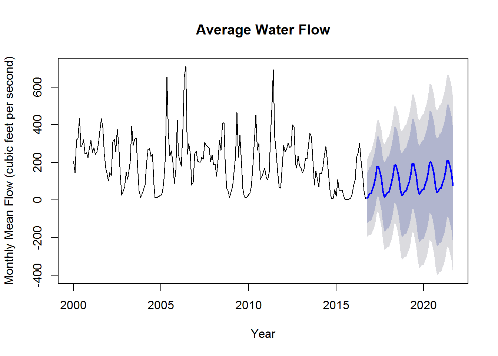
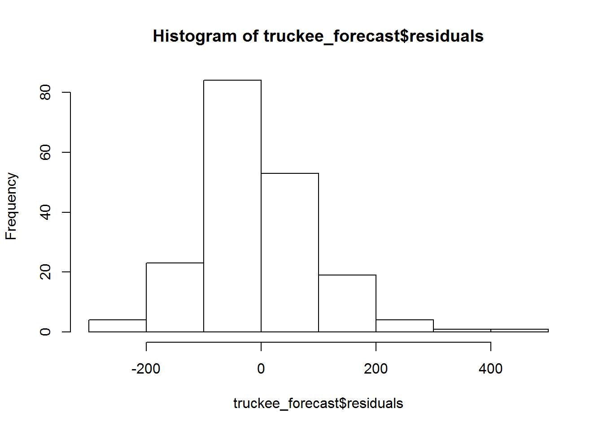
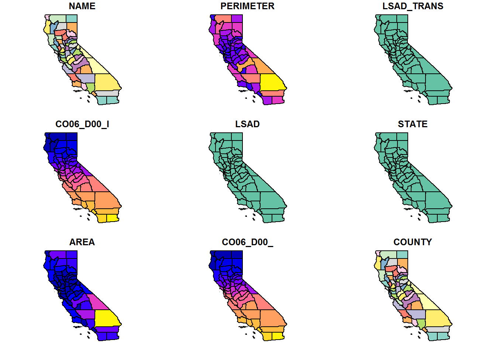
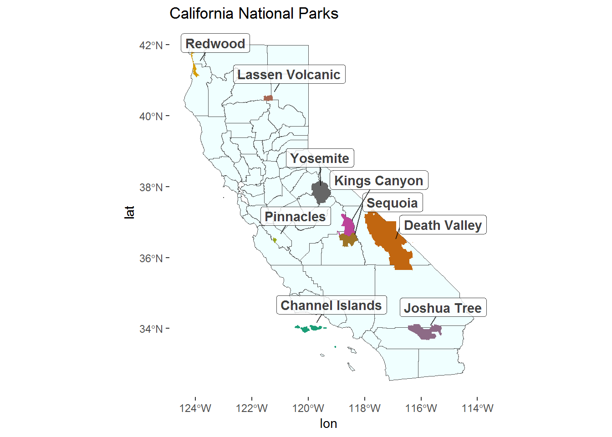
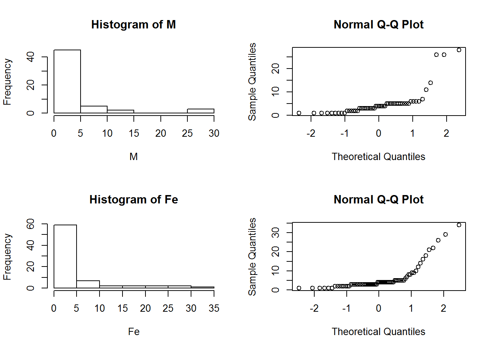

###Part 1

When thinking about science as a collaborative effort to advance what humankind knows about the world around us, open access data is crucial to the transparency and accountability of science. In order to benefit the maximum number of people science should be available to anyone to contribute to. Today many academics are driven by the incentive to publish research constantly, either by financial compensation or academic advancement and tenure. This practice has driven researchers to constantly publish their results first before competitors. In actuality, it has been shown that open access publications receive more citations and further the credibility of researchers than previous non-open access publications (McKiernan et al. 2016). More people have access to the results and the information can therefore be more widely distributed

However, open access of data can provide benefits to everyone by allowing for collaboration and further advancement of the field. In actuality, it has been shown that open access publications also get more media coverage and open access journals are approaching the same impact factors of paid subscription journals. (McKiernan et al. 2016). This transition towards collaborative science has brought about the rise of many tools that researchers can use to make their data accessible. The advancement of technology has allowed this emergence of open access science and the internet allows for large amounts of data to be shared globally by everyone (Bahlai et al. 2019). Even governments are making strides in making information in the form of public repositories and servers. This has lead to increased transparency between citizens and government entities. Furthermore, in the past publishing data has typically forfeited the rights of the author to publishers who use the data and results for their publication purposes. In open access scenarios, authors retain more ownership than historical publications.  In order for open science to work information must flow both ways. If you are accessing available data in order to complete your work, it should be standard procedure that your data become public and available. If everyone accessed free data but refused to follow through and make their results public, it sort of defeats the purpose. 

There are still issues that prohibit everyone from equally accessing open sourced data. Financial barriers and social barriers make it impossible sometimes for everyone to participate (Bahlai et al. 2019). Publication costs are often high for smaller institutions often inhibit progress made. Also, social structure stigma has also inhibited growth of open access science. Some may feel insecure about commenting or providing critical comments about a senior researchers work, in fear of retribution, even though their comments may be useful towards the progress of the science. 

In the past year at Bren my knowledge of open access science has zone from essentially zero to trying to ensure all of my work is available if applicable. Tools like gitHub have enabled students like me to easily replicate and share work. Especially on group projects where code scripts are collaborative and everyone can make real time changes and instantly upload to the internet for others to see. Some limitations to my approach to maintaining open access practices have definitely been more on the technical side of things. Before Bren I had no idea what R or github was. There was a steep learning curve for me to even reach the point where I can make any work that I do accessible to the public or my colleagues. I can see this a deterrent to many people if they want to share their data or results. After a year at Bren (and especially this class) I can say I am comfortable producing results and data that could be replicated or used by other parties for further investigation of my work. Specifically for our group project, we are really striving to make our results accessible because we believe the implications of our research can have wide reaching benefits if the scientific community has access to it. 

###Task 2: Truckee River Flow (2000-2016)

##Part a. Time Series Graph


```r
library(tidyverse)
```

```
## -- Attaching packages --------------------------------------- tidyverse 1.2.1 --
```

```
## v ggplot2 3.1.0       v purrr   0.3.0  
## v tibble  2.0.1       v dplyr   0.8.0.1
## v tidyr   0.8.2       v stringr 1.4.0  
## v readr   1.3.1       v forcats 0.4.0
```

```
## -- Conflicts ------------------------------------------ tidyverse_conflicts() --
## x dplyr::filter() masks stats::filter()
## x dplyr::lag()    masks stats::lag()
```

```r
library(forecast)
library(tseries)
library(sf)
```

```
## Linking to GEOS 3.6.1, GDAL 2.2.3, PROJ 4.9.3
```

```r
library(tmap)
library(leaflet)
library(ggplot2)
library(sp)
library(ggrepel)
library(ggspatial)
library(RColorBrewer)
library(raster)
```

```
## 
## Attaching package: 'raster'
```

```
## The following object is masked from 'package:dplyr':
## 
##     select
```

```
## The following object is masked from 'package:tidyr':
## 
##     extract
```

```r
truckee <- read_csv("truckee_flow_clean.csv")
```

```
## Parsed with column specification:
## cols(
##   Year = col_double(),
##   Month = col_double(),
##   `Monthly Mean Value` = col_double()
## )
```

```r
#View(truckee)
```


```r
truckee_ts <- ts(truckee$`Monthly Mean Value`, frequency = 12, start = c(2000,1))

truckee_ts
```

```
##         Jan    Feb    Mar    Apr    May    Jun    Jul    Aug    Sep    Oct
## 2000 207.90 143.60 320.10 327.70 434.80 281.50 296.60 322.40 244.10 253.10
## 2001 317.90 253.60 278.80 243.30 256.30 297.60 366.60 434.50 386.10 247.30
## 2002 101.50 146.80 129.70 308.30 324.80 257.40 377.50 298.00 133.90  26.60
## 2003 149.90 110.80 163.10 204.70 392.10 289.90 323.60 331.10 173.50  47.30
## 2004  55.10  81.80 195.90 268.50 275.10 232.80 244.30  83.30  12.20  11.60
## 2005  24.90  39.10 110.60 234.40 654.90 357.00 235.40 262.10 200.80  87.50
## 2006 242.20 211.50 180.80 374.90 654.10 708.90 242.10 300.50 248.80  78.70
## 2007 260.60 208.10 202.50 202.20 226.20 217.50 305.90 291.50 284.60 277.00
## 2008 187.30 192.30 126.90 214.30 318.10 265.00 405.50 411.60 216.80  66.20
## 2009  42.60  68.70 146.90 224.70 465.20 226.70 346.30 208.00  62.00  18.90
## 2010  30.70  35.90  76.00 183.80 313.60 451.50 264.80 300.80 108.20 124.30
## 2011 121.30 106.80 145.80 360.80 519.00 694.70 332.70 252.70 147.00  70.50
## 2012 290.70 259.10 270.60 304.90 281.20 284.30 399.90 390.00 193.70 169.20
## 2013 169.50 144.30 163.90 223.50 218.40 291.10 354.70 335.50 208.80  80.40
## 2014  70.00 144.50 137.70 173.40 241.70 284.50 211.10 120.70  29.30   8.10
## 2015  20.50 109.40  54.70  52.50  54.70  21.50   7.18   3.57   3.27   5.98
## 2016  78.80 106.60 226.50 250.20 301.80 207.90 137.60  47.40   9.06       
##         Nov    Dec
## 2000 225.70 281.00
## 2001 170.20 143.60
## 2002  46.50  69.50
## 2003  13.80  34.20
## 2004  18.40  21.50
## 2005 160.40 426.30
## 2006  97.70 244.80
## 2007 206.40 240.20
## 2008  48.00  15.40
## 2009  12.20  18.00
## 2010 146.00 170.70
## 2011  63.40 174.20
## 2012 234.20 181.90
## 2013 153.60 111.10
## 2014   9.57  54.90
## 2015   9.12  34.90
## 2016
```

```r
plot(truckee_ts)
```




# Decomposed ts

```r
truckee_dc <- decompose(truckee_ts)
plot(truckee_dc)
```



# This data does not appear to be additive or multiplicative. This data appears to be stationary because the mean of the trend data seems to be stationary over time. There is definite seasonality in the data, as the water flow peaks once every year probably after the snow melt in spring. There is somewhat of a cyclical trend every 5 or so years.

## Part b: Holt Winters


```r
truckee_hw <- HoltWinters(truckee_ts)
truckee_hw
```

```
## Holt-Winters exponential smoothing with trend and additive seasonal component.
## 
## Call:
## HoltWinters(x = truckee_ts)
## 
## Smoothing parameters:
##  alpha: 0.2418713
##  beta : 0
##  gamma: 0.3384547
## 
## Coefficients:
##            [,1]
## a   107.9677977
## b     0.6172931
## s1  -99.0006323
## s2  -89.9605123
## s3  -76.2339114
## s4  -76.1306479
## s5  -50.3599146
## s6  -28.6056748
## s7    9.4338839
## s8   66.4092717
## s9   64.9338854
## s10  36.9087439
## s11   0.4471458
## s12 -67.5049126
```

```r
plot(truckee_hw)
```



```r
truckee_forecast <- forecast(truckee_hw, h = 60)
plot(truckee_forecast,
     main = "Average Water Flow",
     xlab = "Year",
     ylab = "Monthly Mean Flow (cubic feet per second)")
```



#Figure 1: Monthly Mean Flow of the Truckee River (2000-2016). Time series data showing water flow in cubic feet per second. A Holt Winters function was used to forecast river flow from 2015 to 2020, and is shown with higher and lower bounds seen in the shaded areas. 

##Residuals


```r
hist(truckee_forecast$residuals)
```




###Task 3: Mapping California's National Parks


```r
##Wrangle Data
ca_counties <- read_sf(".", layer = "california_county_shape_file")
st_crs(ca_counties) = 4326
plot(ca_counties)
```



```r
#View(ca_counties)


ca_parks <- read_sf(".", layer = "nps_boundary") %>% 
  dplyr::filter(STATE == "CA") %>% 
  dplyr::filter(UNIT_TYPE == "National Park") %>%  
  #mutate(PARKNAME = ifelse(is.na(ca_parks$PARKNAME), "Redwood", ca_parks$PARKNAME)) %>% 
  mutate(lon=map_dbl(geometry, ~st_centroid(.x)[[1]]),
         lat=map_dbl(geometry, ~st_centroid(.x)[[2]]))
  
ca_parks2 <- ca_parks %>% 
  mutate(PARKNAME = ifelse(is.na(ca_parks$PARKNAME), "Redwood", ca_parks$PARKNAME)) 

st_crs(ca_parks2) = 4326

 
#View(ca_parks2)
  
##Map


color_count <- 9
mycolors <- colorRampPalette(brewer.pal(10, "Dark2"))(color_count)
```

```
## Warning in brewer.pal(10, "Dark2"): n too large, allowed maximum for palette Dark2 is 8
## Returning the palette you asked for with that many colors
```

```r
ggplot(ca_counties)+
  geom_sf(fill = "azure1",
          color = "gray30",
          size = 0.1) +
  geom_sf(data = ca_parks2, 
          aes(fill = PARKNAME),
          color = "NA",
          show.legend = FALSE)+
  geom_label_repel(data = ca_parks2, aes(x=lon, y = lat, label = PARKNAME),
                   box.padding = 0.1,
                   #force = 1,
                  point.padding = 0.75,
                  alpha = 0.75,
                  fontface = 'bold', 
                  color = 'black',
                  nudge_x = 0.5,
                  nudge_y = 0.5)+
  scale_fill_manual(values = mycolors) +
  theme(panel.grid.major = element_line(color = "transparent"), 
        panel.grid.minor = element_blank(),
        panel.background = element_blank(), 
        axis.line = element_blank())+
  ggtitle("California National Parks")
```



###Task 4: Lizards


```r
library(ggplot2)
library(pwr)
library(effsize)


## Data wrangling 

lizard <- read_csv("lter_lizard_pitfall.csv") %>% 
  dplyr::filter(Site == "CALI") %>% 
  dplyr::filter(Sex %in% c("M", "F")) %>% 
  dplyr::filter(Weight != ".") %>% 
  dplyr::filter(TailBreak != ".")
```

```
## Parsed with column specification:
## cols(
##   Date = col_character(),
##   Site = col_character(),
##   Sex = col_character(),
##   Weight = col_character(),
##   TailBreak = col_character()
## )
```

```r
#View(lizard)

Male <- lizard %>%
  filter(Sex == "M") %>% 
  dplyr::select(Weight)

M <- Male$Weight %>% 
as.numeric(Male$Weight)

class(M)
```

```
## [1] "numeric"
```

```r
#View(M)


Female <- lizard %>% 
  filter(Sex == "F") %>% 
  dplyr::select(Weight)

Fe <- Female$Weight %>% 
  as.numeric(Female$Weight)

class(Fe)
```

```
## [1] "numeric"
```

```r
#View(Fe)

par(mfrow = c(2,2))
hist(M)
qqnorm(M)
hist(Fe)
qqnorm(Fe)
```



```r
## T test
  

t_test <- t.test(M, Fe)
t_test
```

```
## 
## 	Welch Two Sample t-test
## 
## data:  M and Fe
## t = -0.6825, df = 123.53, p-value = 0.4962
## alternative hypothesis: true difference in means is not equal to 0
## 95 percent confidence interval:
##  -2.869579  1.398063
## sample estimates:
## mean of x mean of y 
##  5.090909  5.826667
```

```r
# According the two sample t test, the average weight of males was 5.09 grams (n=55) and the average weight of females was 5.82 grams (n= 75). Mean weights are not significantly different t(123) = -0.6825, p value = 0.4962 

## Chi Sq test for tail breaks

tab1 <- table(lizard$Sex, lizard$TailBreak)
tab1
```

```
##    
##      B  W
##   F 17 58
##   M 10 45
```

```r
prop.table(tab1)
```

```
##    
##              B          W
##   F 0.13076923 0.44615385
##   M 0.07692308 0.34615385
```

```r
tails <- lizard %>% 
  dplyr::select(c("Sex", "TailBreak")) 

#View(tails)
  
  
chisq <- chisq.test(tails$Sex, tails$TailBreak)
chisq
```

```
## 
## 	Pearson's Chi-squared test with Yates' continuity correction
## 
## data:  tails$Sex and tails$TailBreak
## X-squared = 0.16319, df = 1, p-value = 0.6862
```

```r
# There is not a significant difference in proportions chisq(1) = 0.16319, p value = 0.6862

male_broken <- 10/55 #0.182
female_broken <- 17/75 #0.223

#Proportions of broken tails
#Males = 10/55
#Females = 17/75

#there is no significant proportion of males (0.182) and females (0.23) with broken tails, pvalue= 0.6862.
```

